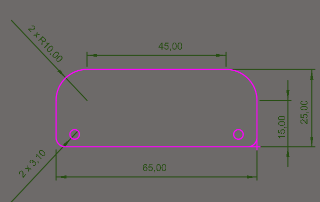
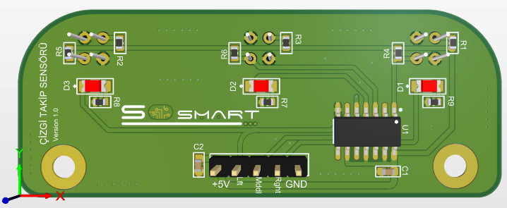
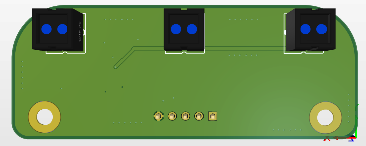
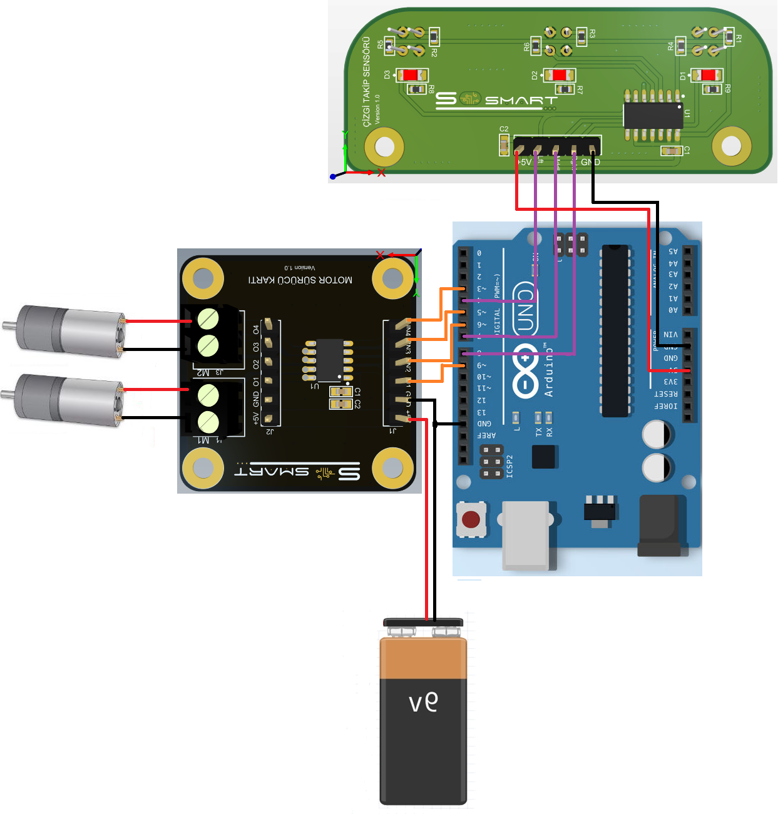
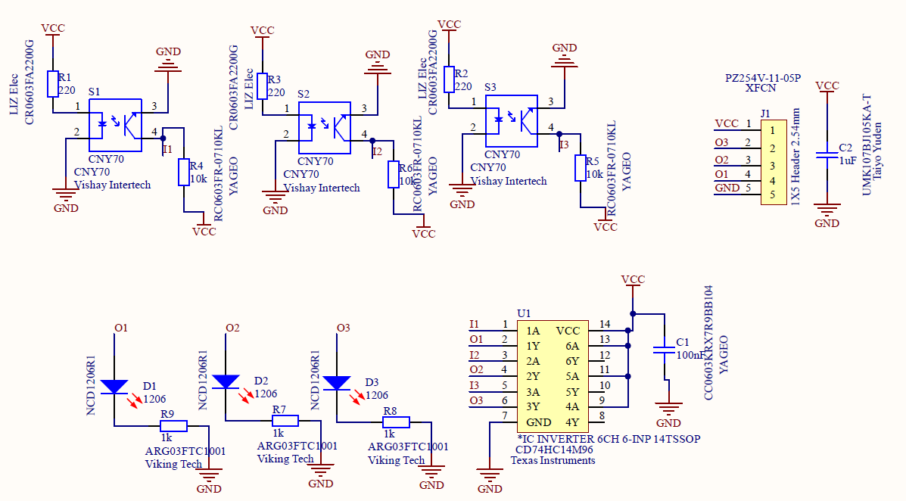

#  Çizgi Takip Kartı

### 1. KAPSAM 
Bu döküman Çizgi Takip Kart'ının tanımını ve çalışma prensibini açıklar.

### 2. ÜRÜN PARAMETRELERİ
- 1 Çalışma Gerilimi: DC +5V 100mA
- 2 Çalışma Sıcaklığı: -40 ~ +85 °C
- 3 Verici Dalga Boyu: 950 nm
- 4 Max Giriş Gerilimi : 6V

### 3. MEKANİK




Pdf [MotorDrive](Mechanic/Line-Follow-Sensor.pdf)

### 4. PİN AÇIKLAMALARI

|Pin Adı|Açıklama|
|------|------|
|+5V|DC +5V besleme pimi|
|Lft|Sol sensör bağlantı pimi|
|Mddl|Orta sensör bağlantı pimi|
|Rght|Sağ sensör bağlantı pimi|
|GND|Toprak bağlantı pimi|

### 5. Arduino Bağlantısı


- Yukarıdaki şemada Çizgi Takip Kartının Motor Sürücü Kartı ile birlikte kullanımını gösterilmektedir. Bu şema aynı zamanda örnek bir çizgi izleyen robot taslağı olarak kullanılabilir.

### 6. Devre


Data Sheet [74HC14](Circuit/74HC14.pdf)

Data Sheet [CNY70](Circuit/cny70.pdf)

Sch File [Line-Follow-Sensor](Circuit/Line-Follow-Sensor.pdf) 

Bom List [BomList](Circuit/Line-Follow-Sensor-BomList.pdf) 

Gerber File [Gerber](Circuit/Line-Follow-Sensor.zip) 

### GENEL BAKIŞ
Çizgi Takip Kartı 3 adet CNY70 sensöründen oluşan siyah beyaz zeminde bulunan çizgileri tanımlayabilmesi amacıyla tasarlanmıştır. Prototiplemeye imkan sağlaması, arduino ve çeşitli devrelerde rahatça kullanılabilmesi için gerekli pinler devre kartı sayesinde dışarıya alınmıştır.Standart pin yapısı sayesinde rahatça kontrol edilebilir. Jumper kablolar ile bağlantıları yapılabilir.Detaylı bilgi için linkler incelenebilir.
### Arduino Örnek Kodu
```

int r=4;
int m=7;
int l=8;


void setup(){
  Serial.begin(9600);
  
  pinMode(r,INPUT);
  pinMode(m,INPUT);
  pinMode(l,INPUT);
  
  }

void loop (){
  
  int sdr = digitalRead(r);
  int sdm = digitalRead(m);
  int sml = digitalRead(l);
  
  Serial.print(sdr);
  Serial.print(sdm);
  Serial.println(sml);
  
  
  delay(100);
  }

```

[Line Follow](ArduionoExample/cizgitakip/cizgitakip.ino)
